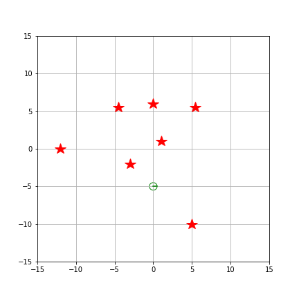
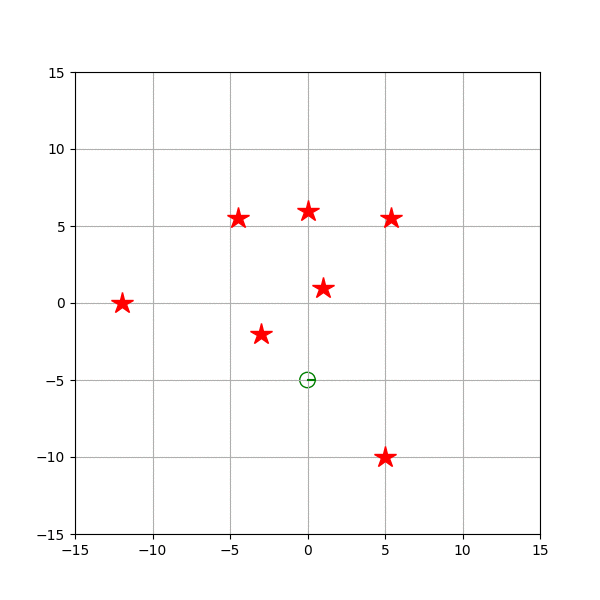

# probabilistic_robotics

2023年度 確率ロボティクス課題 
パーティクルフィルタによりノイズがのった制御指令値で動いているロボットの位置推定を行う． 
Jupyter Notebookを使用したパーティクルフィルタを使用した位置推定のシミュレーションを行える． 

## 確認済み実行環境
* Jupyter Notebook
* Python 3.8.10
* WSL2
* CPU: intel core-i7 13700k

## 実行例
 

## 参考
上田隆一(2019).『詳解　確率ロボティクス　Pythonによる基礎アルゴリズムの実装』.講談社 
小川雄太郎(2018). 『つくりながら学ぶ！深層強化学習』.マイナビ出版 
https://www.slideshare.net/ryuichiueda/sci14 
https://inzkyk.xyz/kalman_filter/ 

